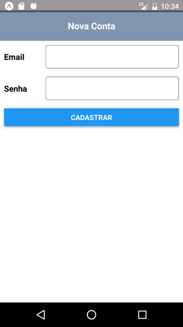

# Projeto 3: Formulário de Cadastro

Este projeto é parte do curso **Aplicativos Móveis com o React Native**, criado por Renan Martins (@nbkhope).

[Clique aqui para acessar o curso](https://www.udemy.com/course/aplicativos-moveis-com-o-react-native/).

## Screenshots




## Como Rodar

Instale as dependências:

```sh
npm install
```

Rode:

```sh
npm start
```

Existem várias maneiras de abrir o aplicativo. Por exemplo, para abrir o aplicativo no iPhone:

- Deixe o seu celular conectado na mesma rede de Internet do seu computador.
- Abra o app de Camera e aponte-a para o código QR do terminal.
- Ele abrirá o app do Expo Go e carregará o aplicativo. Se não tiver o app do Expo, baixe-o na loja de apps.

### Backend

Rode o backend de desenvolvimento em uma aba/janela separada do terminal, com o seguinte comando:

```
npm run dev-server
```

#### Desenvolvimento sem Emulador/Simulator

Caso esteja a desenvolver o aplicativo diretamente do smartphone com o aplicativo do Expo, haverá problema de conexão entre o cliente e esse backend que roda em uma máquina diferente. Pra resolver isso, use o localtunnel. Com o backend já rodando em uma aba do terminal, abra outra separada. Rode:

```
npm run dev-tunnel
```

Substitua todas as instâncias de `localhost:3000` no seu código do aplicativo com o valor da URL imprimido no console pelo comando acima.

Pode ser que não funcione logo após essa mudança, então recomendo carregar o aplicativo no app do Expo do zero novamente (mude o código do aplicativo, desligue servidor do frontend, daí inicie de novo).

## Em Caso de Erro

Como o desenvolvimento do React Native ocorre frequentemente, uma nova versão poderá deixar o Expo de funcionar com o aplicativo. Para resolver isso, basta atualizar os pacotes em `package.json` para a versão mais atual.

Uma maneira de saber qual os números específicos usar é assim:

- Em algum outro lugar, instale e use `create-expo-app` para gerar um novo projeto de amostra.
- Verifique o número das versões desse novo aplicativo e copie de acordo.
